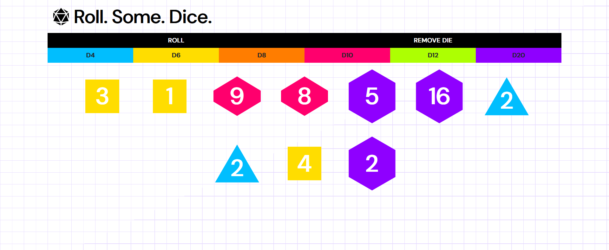

# Dice Rolling System

This is a simple web-based dice rolling system that allows you to roll various types of dice commonly used in tabletop games. It's designed to be user-friendly and visually appealing.

## Features

- **Multiple Dice Types:** Roll the most popular tabletop RPG dice, including d4, d6, d8, d10, d12, and d20.

- **Add and Remove Dice:** Easily add or remove dice from your virtual tabletop.

## Usage

1. **Rolling Dice:**
   - Click on the dice to roll it.
   - The result is displayed with an animated roll effect.
   - Alternatively, you can roll all dice at once by clicking on the "Roll" button.

2. **Adding Dice:**
   - Use the "Add" buttons to add different types of dice to your virtual tabletop.

3. **Removing Dice:**
   - Click the "Remove" button to remove the last added die.

## Installation

No installation is required. Simply visit the [GitHub Pages](https://candido-caymmi.github.io/dice-roller/) for this repository to use the dice rolling system.

## Technologies Used

- HTML
- CSS
- JavaScript
- Bootstrap 5

## Contributing

If you have suggestions or improvements, feel free to open an issue or submit a pull request!